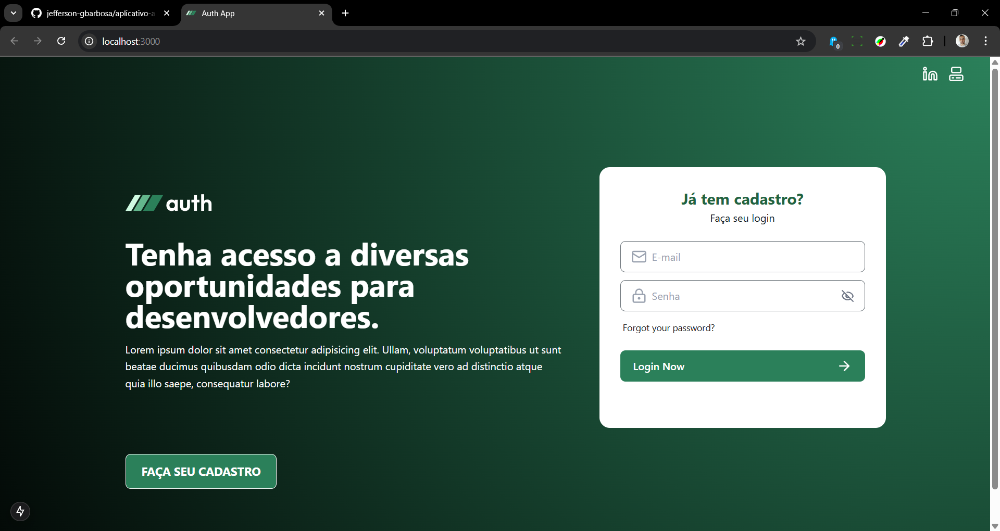
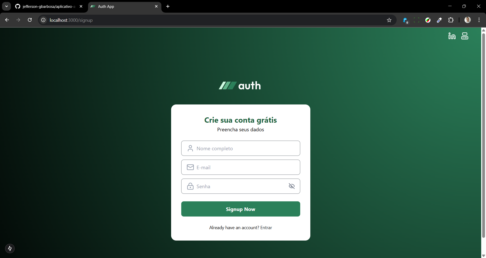
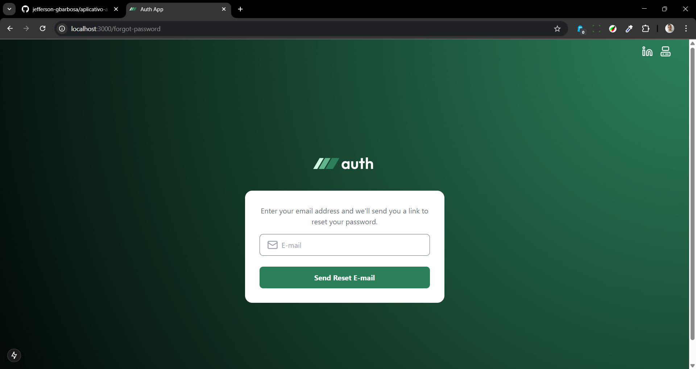

#  🔐 AUTH-APP-WEB

## Conteúdo
* [Sobre a aplicação](#sobre-a-aplicação)
* [Tecnologias](#hammer_and_wrench-tecnologias)
* [Iniciando a Aplicação](#car-Iniciando-a-aplicação)
* [Screenshots](#camera_flash-screenshots)
* [Contato](#email-contato)

## Sobre a aplicação
Este projeto é uma aplicação de autenticação simples, que oferece funcionalidades de login, cadastro de usuários e recuperação de senha. Ela é construída utilizando as tecnologias mais recentes do ecossistema JavaScript para garantir uma interface moderna, responsiva e acessível.
 
## :hammer_and_wrench: Tecnologias
A aplicação utiliza as seguintes tecnologias:
* React: Biblioteca JavaScript para construção de interfaces de usuário baseadas em componentes, proporcionando uma experiência de usuário interativa e dinâmica.
* TypeScript: Superset do JavaScript que adiciona tipagem estática, aumentando a segurança e a produtividade durante o desenvolvimento.
* React Router: Biblioteca para gerenciar a navegação entre as páginas e componentes da aplicação, possibilitando o roteamento entre telas como login, cadastro e recuperação de senha.
* React Hook Form: Biblioteca para gerenciamento de formulários em React, reduzindo re-renderizações e melhorando a performance em formulários grandes.
* Zod: Biblioteca para validação de esquemas em TypeScript, garantindo validações robustas e seguras nos dados dos formulários.
* Axios: Biblioteca para realizar requisições HTTP, facilitando a comunicação com o back-end, como no login, cadastro e recuperação de senha.
* Lucide React: Conjunto de ícones modernos e minimalistas que melhoram a experiência visual da interface.
* React Icons: Biblioteca que fornece acesso fácil a ícones populares, como os do Font Awesome e Material Icons, diretamente em React.
* React Toastify: Biblioteca para exibir notificações do tipo "toast", úteis para dar feedbacks rápidos (como sucesso ou erro) sobre operações na aplicação.
* React Spinners: Biblioteca para exibir indicadores de carregamento enquanto a aplicação processa dados ou aguarda respostas de requisições.
* @radix-ui/react-form: Componente acessível da Radix UI para a construção de formulários, com foco em boas práticas de acessibilidade e UI.
* @radix-ui/themes: Biblioteca da Radix UI que oferece temas prontos e componentes que ajudam na criação de interfaces coesas e responsivas.
Frontend
* Next.js (15.1.7): Framework React para aplicações otimizadas para SEO e renderização do lado do servidor (SSR).
* React (19.0.0) e React DOM (19.0.0): Biblioteca para criação de interfaces dinâmicas e componentes reutilizáveis.
* React Hook Form (7.54.2): Gerenciamento eficiente de formulários com validação integrada.
* Lucide React (0.475.0): Biblioteca de ícones para React com design moderno.
* React Toastify (11.0.5): Exibição de notificações toast personalizadas.
* React Spinners (0.15.0): Conjunto de componentes para spinners de carregamento.
* Axios (1.8.1): Cliente HTTP para comunicação com APIs.
* JS Cookie (3.0.5): Manipulação de cookies no navegador.
Estilização
* Tailwind CSS (4.0.8): Framework CSS utilitário para estilização rápida e responsiva.
* Tailwind Merge (3.0.2): Mescla de classes do Tailwind para evitar conflitos.
* @tailwindcss/postcss (4.0.8) e PostCSS (8.5.3): Processamento CSS moderno.
Validação
* Zod (3.24.2): Biblioteca para validação e tipagem segura de dados.
* @hookform/resolvers (4.1.2): Integração do Zod com o React Hook Form para validação de formulários.
Autenticação
* App Auth Web: Módulo de autenticação próprio utilizado na plataforma.
Desenvolvimento e Tipagem
* TypeScript (5.x): Superset do JavaScript com tipagem estática.
* @types/node (20.x), @types/react (19.x), @types/react-dom (19.x), @types/js-cookie (3.0.6): Tipagens TypeScript para bibliotecas utilizadas.
Ferramentas de Desenvolvimento
* @biomejs/biome (1.9.4): Ferramenta para formatação, linting e otimização de código.

## :car: Iniciando a aplicação
#### 1.Clonando o Repositório
Baixe o repositório com git clone e entre na pasta do projeto.
```bash
$ git clone https://github.com/jefferson-gbarbosa/app-auth-web
```
#### 2.Instalando Dependências
Entre na pasta do projeto e instale as dependências com o comando abaixo:
```bash
# Instale as dependências
cd auth-app-web
npm install

```
#### 3.Configuração do Back-End 
 Antes de rodar a aplicação, configure o IP do seu back-end no arquivo src/services/api.ts _src/api/api.ts_<br/>
#### 4.Rodando a Aplicação
Agora, você pode rodar a aplicação localmente com o comando abaixo. Ela será iniciada na porta 3000:
```bash
npm run dev
```
## :camera_flash: Screenshots
* Página de Home
<br/>
* Página de Registro de Usuários
<br/>
* Página para Recuperação de Senhas

## :rocket: Deploy on Vercel

The easiest way to deploy your Next.js app is to use the [Vercel Platform](https://vercel.com/new?utm_medium=default-template&filter=next.js&utm_source=create-next-app&utm_campaign=create-next-app-readme) from the creators of Next.js.

Check out our [Next.js deployment documentation](https://nextjs.org/docs/app/building-your-application/deploying) for more details.
## :email: Contato

E-mail: [**jeffersonqx@gmail.com**](mailto:jeffersonqx@gmail.com)


